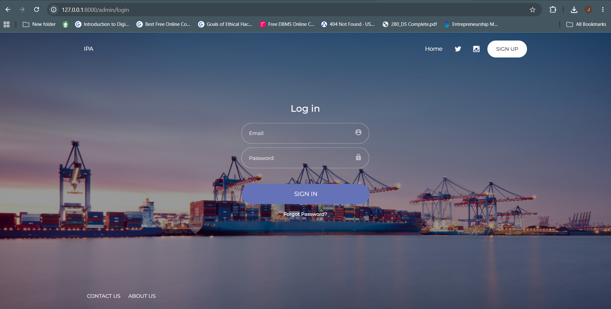
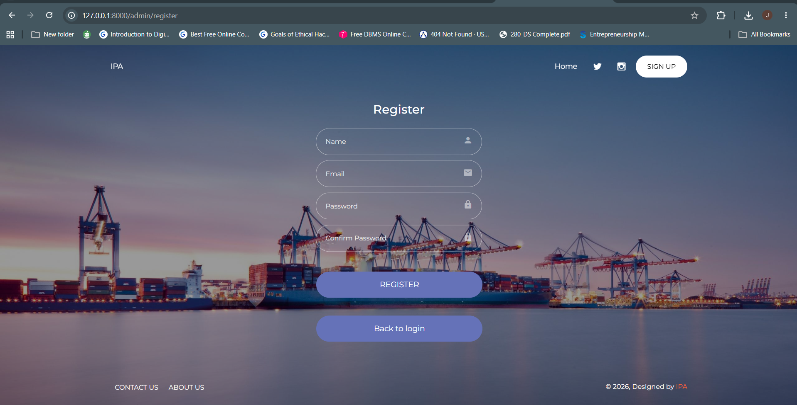
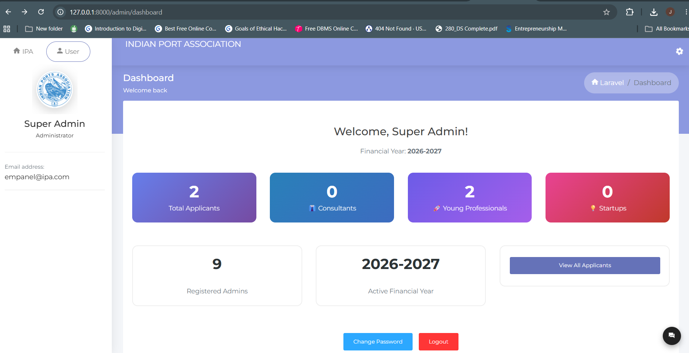
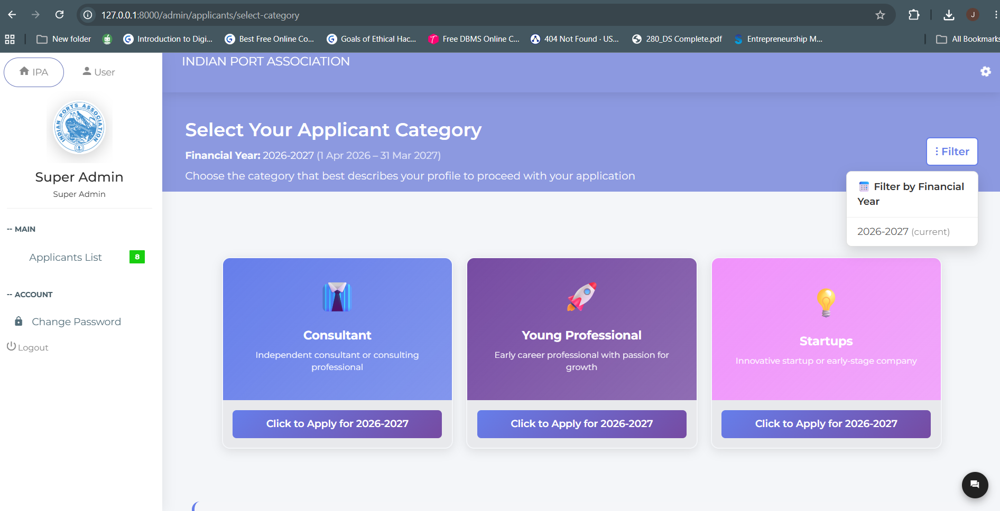
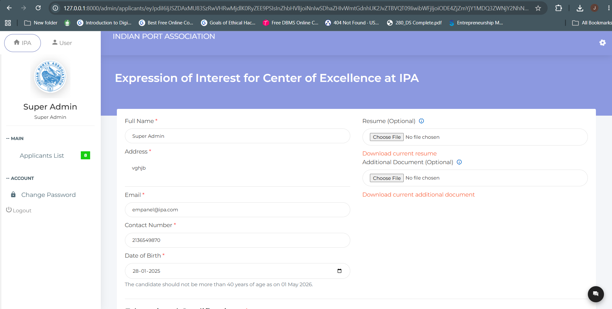

# IPA Empanelment Portal

A Laravel-based admin portal for the **Indian Ports Association (IPA) Center of Excellence** empanelment process. It lets professionals register, verify their email, select a category, and submit an Expression of Interest (EOI) with their education and work experience, while super-admins review, edit, and export applicant records.

---

## Screenshots

### Login Page


### Register Page


### Super-Admin Dashboard


### Category Selection


### Applicant Form


---

## Features

- **Admin authentication** — registration, login, logout, and password reset with a dedicated `admin` auth guard (separate from the default user guard).
- **Email verification** — a 6-digit code is emailed on registration and expires after 48 hours; unverified accounts cannot log in.
- **Category-based application** — applicants choose from Consultant, Young Professional, or Startup before filling the EOI form.
- **Financial year system** — applications are tracked per financial year (1 Apr – 31 Mar). Filter by past years using the FY filter.
- **Age validation** — candidates must not be more than 40 years of age as on 01 May 2026.
- **Role-based access** — regular admins manage their own application; super-admins view, edit, delete, filter, and export all applicants. Enforced via the `admin.super` middleware.
- **Applicant management** — name, address, DOB, contact, category selection, multiple education entries, and multiple experience entries, plus resume and additional document uploads (PDF/DOC/DOCX).
- **CSV export** — super-admins can export the full applicant list.
- **Security hardening** — bcrypt password hashing (12 rounds), session regeneration on login/logout, login rate-limiting (5 attempts/min), encrypted route keys so applicant IDs are never exposed in URLs, and mass-assignment protection.

---

## Tech Stack

| Layer | Technology |
|-------|-----------|
| Framework | Laravel 12 (PHP 8.2+) |
| Database | MySQL |
| Frontend | Blade templates, Bootstrap-based admin theme |
| Build | Vite |
| Deployment | Docker / Docker Compose (optional) |

---

## Portal Routes

| Route | Access | Description |
|-------|--------|-------------|
| `/admin/login` | Public | Admin login |
| `/admin/register` | Public | Admin registration |
| `/admin/verify` | Public | Email verification |
| `/admin/dashboard` | Auth | Dashboard with stats |
| `/admin/applicants/select-category` | Auth | Category selection page |
| `/admin/applicants/create` | Auth | EOI application form |
| `/admin/applicants` | Super Admin | All applicants list |
| `/admin/applicants/export/csv` | Super Admin | CSV export |
| `/admin/applicants/{id}/edit` | Super Admin | Edit applicant |
| `/admin/admins` | Super Admin | Admin management |

---

## Getting Started (Local)

```bash
# 1. Install dependencies
composer install
npm install

# 2. Environment
cp .env.example .env
php artisan key:generate

# 3. Configure your database in .env
#    DB_DATABASE=empanelmentadmin
#    DB_USERNAME=root
#    DB_PASSWORD=

# 4. Run migrations
php artisan migrate

# 5. Build assets and serve
npm run dev
php artisan serve
```

The app runs at `http://localhost:8000`. The admin area lives under `/admin`.

> Mail is set to the `log` driver by default, so verification codes appear in `storage/logs/laravel.log` during local development.

---

## Docker

A Docker setup is included. See [`DOCKER_SETUP.md`](DOCKER_SETUP.md) for full instructions.

```bash
cp .env.docker.example .env.docker
docker-compose up -d
```

---

## Testing

```bash
php artisan test
```

See [`APPLICANT_GUIDE.md`](APPLICANT_GUIDE.md) for the end-user walkthrough.

---

## Author

Jesika Choudhary — B.Tech Information Technology, Manipal University Jaipur (2023–2027).
